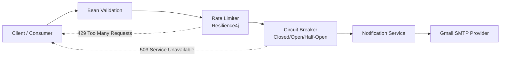

# Resilient Notification Microservice | Enterprise-Grade Email Gateway


Microservicio de notificaciones por correo diseñado para escenarios reales donde no basta con “enviar un email”. Este servicio prioriza **resiliencia operacional**, **control de abuso** y **diseño limpio de API** para proteger la continuidad del sistema incluso cuando el proveedor SMTP se degrada.

---

## ¿Qué problema resuelve?

En producción, un gateway de correo enfrenta dos riesgos críticos:

1. **Abuso de API (spam o ráfagas accidentales)**
   - Puede agotar cuotas del proveedor SMTP.
   - Puede disparar bloqueos temporales de cuenta.
2. **Inestabilidad de proveedores externos (ej. Gmail SMTP)**
   - Timeouts, respuestas erráticas o caídas parciales.
   - Si no se aíslan, propagan latencia y fallos al resto del sistema.

### Solución aplicada

Se implementa una capa de protección con **Resilience4j**:

- **Rate Limiter** para controlar ritmo de consumo.
- **Circuit Breaker** para cortar llamadas a dependencias enfermas y evitar cascadas.

Esto convierte al servicio en un **boundary robusto** entre tu dominio y un tercero no determinista.

---

## Arquitectura de resiliencia y seguridad



El flujo protege primero la entrada (validación + rate control) y luego el acceso al proveedor externo (circuit breaker), asegurando que el thread principal no quede bloqueado por una dependencia degradada.

---

## Resiliencia (sección crítica)

### 1) Rate Limiting — ¿por qué 5 req/min?

Una política de **5 req/min por consumidor** es una referencia sólida para entornos iniciales porque:

- Reduce la probabilidad de **agotamiento de cuota SMTP**.
- Mitiga picos de tráfico malicioso o errores de cliente (loops/reintentos sin control).
- Mantiene costo operativo predecible y evita throttling agresivo del proveedor.

> Nota: en esta demo la configuración puede variar (ej. `2/min`) para facilitar pruebas controladas; en producción la recomendación base es `5/min` y ajustar por métricas.

### 2) Circuit Breaker — papel del estado Half-Open

El **Half-Open** es el estado de diagnóstico controlado:

- Tras un período en **Open**, el breaker permite un número mínimo de llamadas de prueba.
- Si esas llamadas son exitosas, vuelve a **Closed**.
- Si fallan, retorna a **Open** sin exponer el sistema a una nueva tormenta de errores.

Resultado: se protege el **hilo de ejecución principal** de latencias repetitivas, timeouts encadenados y consumo innecesario de recursos cuando SMTP está degradado.

---

## Interface-First con OpenAPI 3

La documentación no está “pegada” a la implementación del controlador. Se usa enfoque **Interface-First** para definir contrato y semántica de endpoint con OpenAPI, manteniendo:

- Controladores más limpios y enfocados en orquestación.
- Mejor mantenibilidad del contrato REST.
- Menor acoplamiento entre documentación y lógica de negocio.

Swagger UI:
- `http://localhost:5002/api/v1/swagger-ui.html`
- `http://localhost:5002/api/v1/documentation`

---

## Infraestructura: Docker multi-stage + Layertools

El `Dockerfile` usa estrategia multi-stage con extracción por capas (`jarmode=layertools`):

- **Optimiza caché de build**: dependencias cambian menos que el código de aplicación.
- **Reduce tiempo de reconstrucción** en CI/CD.
- **Disminuye peso final de imagen** y mejora tiempo de pull/deploy.
- Mantiene imagen runtime más limpia al separar etapa de compilación.

---

## Guía de instalación profesional

### 1) Clonar y configurar variables

Crea archivo `.env` en la raíz:

```env
CORREO_PRUEBA=tu-cuenta@gmail.com
PASSWORD=tu-app-password
MAIL_HOST=smtp.gmail.com
MAIL_PORT=587
```

### 2) Configurar Gmail App Password (requerido)

1. Activa verificación en dos pasos en Google Account.
2. Genera un **App Password** para “Mail”.
3. Usa ese valor en `PASSWORD`.

> No uses tu contraseña principal de Gmail en ambientes locales ni productivos.

### 3) Construir y levantar

```bash
./mvnw -DskipTests clean package
docker build -t mail-notifier-service:local .
docker compose up --build
```

API base:
- `http://localhost:5002/api/v1`

---

## Endpoint principal

- `POST /api/v1/send/mail`

Payload de ejemplo:

```json
{
  "name": "Jane Doe",
  "email": "jane.doe@example.com",
  "message": "Hola, esto es una prueba"
}
```

Respuestas clave:
- `200 OK` envío exitoso.
- `400 Bad Request` validación de DTO.
- `429 Too Many Requests` rate limit alcanzado.
- `503 Service Unavailable` circuit breaker abierto.

---

## Demo


